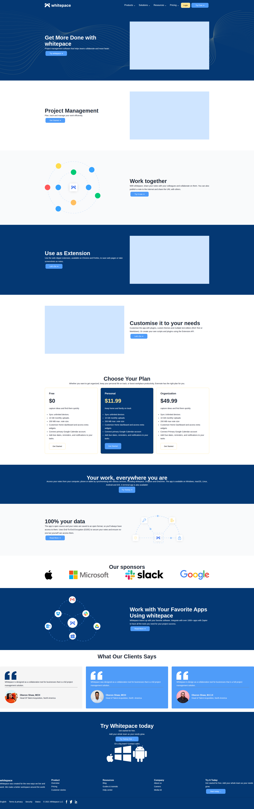

# Figma Whitespace

## preview

## About

Figma Whitepace is a responsive frontend project built from a Figma design.
The goal of this project is to accurately replicate the provided UI design while maintaining clean code structure.

## This project demonstrates:

Proper semantic HTML structure

Responsive layout using CSS

Modern UI styling

Clean section-based organization

* Project Sections

- Hero Section – Contains the main headline, short description, and call-to-action button.

-Features Section – Highlights the main product features with descriptions.

- Work Management Section – Explains productivity tools and integrations.

- Pricing Section – Displays pricing plans in a structured card layout.

- Testimonials Section – Shows client feedback.

- Footer – Contains navigation links and additional resources.

Design File

* The original design can be found here:
 [https://www.figma.com/design/Ip0YLscX7e46Dxu1cVreDB/Whitepace---SaaS-Landing-Page-(Community)?node-id=9-100&p=f&t=ph5rB3i6qTqdcPAu-0]

* Built With

- HTML

- CSS

* To understand and work on this project, you should have:

- Basic knowledge of HTML

- Basic knowledge of CSS

- Understanding of Flexbox

- Understanding of CSS Grid

- Basic Git & GitHub knowledge

* Clone Project

To get a local copy up and running follow these simple steps:

Clone this repository using your terminal or command line:

[https://github.com/ChiaEndu/Html-project-1]

Change to the project directory:

cd Html-project

Command Line Steps

$ git clone [https://github.com/ChiaEndu/Html-project-1]

$ cd Html-project

$ git checkout main

Start App

Since this is a static frontend project:

Open the project folder

Open index.html in your browser

Or use Live Server if you are using VS Code.

Test

This project was tested for:

Responsive behavior on different screen sizes

Author

Chia

GitHub: @ChiaEndu

LinkedIn: Chia Endurance